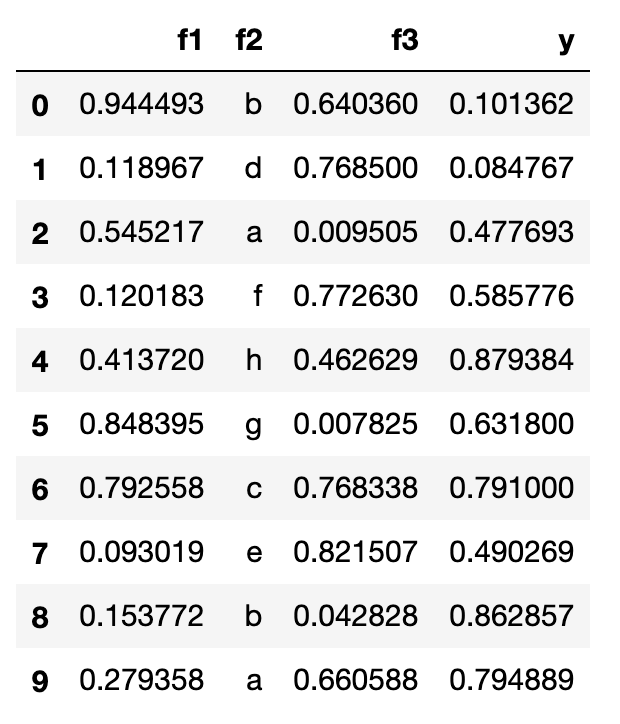
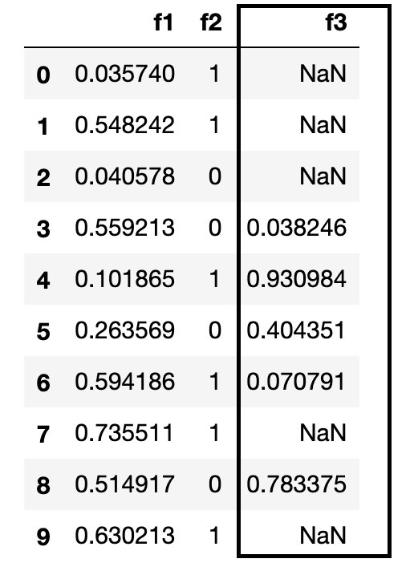

# task_substitution
> Solve an auxiliary task using ML.

**Task Substitution** is a method of solving an auxiliary problem ( with different features and different target ) in order to better understand the initial problem and solving it efficiently. 

Let's take a look at standard machine learning task, in the figure below you see a regression task with features `f1`, `f2`, `f3` and target variable `y`.

We want to build on a model on the above dataset to predict for unknown `y` values in the test dataset shown below.

### Exploratory Data Analysis

We start off looking at the data itself and look for relationships of different features among themselves and with the target variable. There can be many features with *missing values* or *outliers* which needs to be understood. It is possible that there is a relationship between a missing value and values of other features.

#### Recover Missing Values

It is possible for a feature to have a missing value, it could be a data recording issue or bug etc. Often times for numerical features we replace missing value with `mean` or `median` value as a approximation. Sometimes we replace missing value with values like `-9999` so that model treats them differently or sometimes we leave them as is as libraries like `xgboost` and `lightgbm` can handle `nulls`. Let's look at following dataset

Here we have a feature `f3` with missing values, this is a numerical feature, what we can do is that we can consider `f3` as target feature and reframe this as regresion problem where we try to predict for missing values.

The above setup is identical to the original regression task, here we would build a model to use `f1` and `f2` to predict for `f3`. So instead of using `mean`, `median` etc. we can build a model to restore missing values which can help us solve the original problem efficiently.

We have to be careful to not overfit when building such models.

## Install

`pip install your_project_name`

## How to use

Fill me in please! Don't forget code examples:
